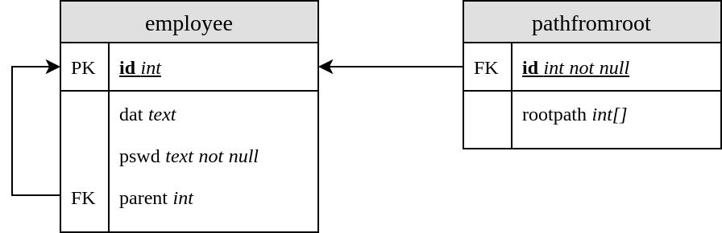

_Przemysław Joniak, grupa 1_

# Zarządzanie Korporacją X

Uruchomienie: `python corp_api.py [-h] [-init] [-file file] [-debug]`. 

API zostało napisane w Pythonie3. Przed pierwszym uruchomienim wymagane jest, aby istniał użytkownik `init` z uprawnieniami `CREATEDB` i `CREATEUSER`, oraz baza danych do której `init` ma dostęp.


## Przykładowe uruchimienia:
```bash
# Inicjalizacja bazy danych, dane pobierane są z pliku
python3 corp_api.py -init -file test/init.json

# Inicjalizacja bazy danych, dane pochodzą ze standardowego wejścia
make init < test/init.json

# Drugie uruchomienie aplikacji, dane pochodzą ze standardowego wejścia
python3 corp_api.py < test/2nd-oks.json
make run < test/2nd-oks.json

# Kolejne uruchomienie aplikacji, dane pochodzą ze standardowego wejścia, a w przypadku błędu wyświetlane są dodatkowe informacje
python3 corp_api.py -debug < test/2nd-errors.json 

# Czyszczenie zawartości bazy danych (wymaga su)
make resetdb

# Usuwanie plików tymczasowych Pythona
make clean
```

## Model fizyczny



Ładowany przy pierwszym uruchimieniu aplikacji model fizyczny znajduje się w pliku `api_schema.sql`. Zdefiniowane są tam kolejno:
- tabele `employee` oraz `pathfromroot`

    - `employee` zawiera podstawowe informaje o pracowniku: jego `id`, hasz hasła `pswd`, dane `dat` oraz wskaźnik `parent` na swojego przełożonego.  `parent` szefa (korzenia) jako jedyny jest pusty. Ze wzglądów bezpieczeństwa atrybut `pswd` nie może być pusty.
    - `pathfromroot` dla każdego pracownika trzyma ścieżkę od korzenia do tego pracownika wyłącznie. Ta ścieżka jest typu `array::int` (w szczególności ścieżka dla korzenia to: `[]` )
- użytkownik `app` wraz z odpowiednimi uprawnieniami
- rozszerzenie `pgcrypto` do obliczania haszy haseł
- wyszczególnine w specyfikacji funkcje API ze, które wywoływane są z poziomu pythona. Dodtkowo zaimplementowane zostały funkcje:
    - `auth_emp(admin, pswd)` - zwraca `true` wtedy i tylko wtedy, gdy podane dane logowania pracownika są poprawne
    - `emp_exists(emp)` - zwraca `true` wtedy i tylko wtedy, gdy pracownik `emp` istnieje w bazie danych

    Szczegółowy opis wszystkich funkcji zajduje sie w części `Implementacja`

## Implementacja

API zostało zaprojektowane tak, aby jak największa odpowiedzialność za logikę spoczywała na funkcjach sql zdefiniowanych w `api_schema.sql`. Treść pliku `corp_api.py` stanowi adapter do tych funkcji:


### `DbAdapter`
Klasa adaptera bazy danych. Odpowiedzialna za otwieranie i utrzymywanie połączenia z bazą danych.

Ogólne działanie każdej funkcji operującej na bazie danych można zobrazować poniższym pseudokodem:
    
    def operacja(data):
        1. Pozyskaj dane ze słownika `data`
        2. Sprawdź odpowiednie uprawnienia
        3. (opcjonalnie) sprawdź czy pracownik istnieje
        4. Wykonaj odpowiednik operacji w sql
        5. Zwróć dane

Każda z funkcji może zwrócić albo żądaną wartość, albo wartość pustą, albo rzucić wyjątkiem.


- `open(data)`
    
    Nazwiązuje połączenie z bazą danych. Rzucany jest wyjątek o ile połączenie się nie powiedzie. `data` jest słownikiem z kluczami: `database`, `login`, `haslo` oraz opcjonalnym `host`.
    Wywowołuje funkcję `init()` inicjującą bazę, o ile zostało to wyszczególnione w konstruktorze klasy.

    _Wartość zwracana:_ `None`

- `init(schema='api_schema.sql')`

    Inicjuje bazę danych modelem fizycznym zawartym w pliku `schema` (domyślnie: `api_schema.sql`)

    _Wartość zwracana:_ `None`

- `root(data)`

    Tworzy korzeń (szefa firmy) o identyfikatorze `emp`, haśle `newpassword` oraz (opcjonalnych) danych `data`. Poprawność parametru `secret` sprawdzana jest na poziomie sql.

    _Wartość zwracana:_ `None`

- `new(data)`

    Dodaje nowego pracownika `emp`, `newpasswd`, [`data`]. Jeżeli `admin` z hasłem `passwd` nie ma uprawnień do dodania pracownika, to rzucany jest wyjątek.

    _Wartość zwracana:_ `None`
    
- `remove(data)`

    Usuwa pracownika `emp` wraz z całym jego poddrzewem. Jeżeli `admin` z hasłem `passwd` nie ma uprawnień do usunięcia pracownika, to rzucany jest wyjątek.

    `remove()` na poziomie sql zaimplenetowany jest jako prosta kwerenda _`DELETE FROM`_. Drzewo pod pracownikiem usuwa się samoczynnie poprzez _`ON DELETE CASCADE`_  założonym na odpowiednie atrybuty.

    _Wartość zwracana:_ `None`

- `ancestors(data)`

    Zwraca tablicę identyfikatorów pracowników, którym `emp` [nie] bezpośrendio podlega. Jeżeli `admin` z hasłem `passwd` nie ma uprawnień do tej operacji, to rzucany jest wyjątek. 

    Na poziomie sql wybierany jest _array_, który zawiera ścieżkę od korzenia do danego pracownika (bez niego).

    _Wartość zwracana:_ `[ ]::int`

- `ancestor(data)`

    Sprawdza, czy `emp2` jest [nie] bezpośrednim przełożonym pracownika `emp1`. Jeżeli `admin` z hasłem `passwd` nie ma uprawnień do tej operacji, to rzucany jest wyjątek.

    `ancestor()` wywołuje pomocniczą funkcę `is_superior`

    _Wartość zwracana:_ `boolean`

- `parent(data)`

    Zwraca bezpośredniego pracownika `emp`. Szef firmy jako jedyny nie posiada takigo przełożonego - dla niego zwacany jest `NULL`. Jeżeli `admin` z hasłem `passwd` nie ma uprawnień do tej operacji, to rzucany jest wyjątek.

    _Wartość zwracana:_ `int` lub `NULL` (dla szefa)

- `child(data)`

    Zwraca wszystkich pracowników bezpośrednio podległych pracownikowi `emp`. Jeżeli `emp` nie istnieje lub `admin` z hasłem `passwd` nie ma uprawnień do tej operacji, to rzucany jest wyjątek.

    _Wartość zwracana:_ `[ ]::int`

- `read(data)`

    Zwraca dane pracownika `emp`. Jeżeli `emp` nie istnieje lub `admin` z hasłem `passwd` nie ma uprawnień do tej operacji, to rzucany jest wyjątek.

    _Wartość zwracana:_ `string`

- `update(data)`
    
    Uaktualnia dane pracownika `emp`. Jeżeli `emp` nie istnieje lub `admin` z hasłem `passwd` nie ma uprawnień do tej operacji, to rzucany jest wyjątek.

    _Wartość zwracana:_ `None`

- `descendants(data)`

    Zwraca wszystkich pracowników [nie] bezpośrednio podległych pracownikowi `emp`. Jeżeli `emp` nie istnieje lub `admin` z hasłem `passwd` nie ma uprawnień do tej operacji, to rzucany jest wyjątek.

    W sql funkcja ta zaimplementowana jest rekurencyjnie.

    _Wartość zwracana:_ `None`

- `authorise(self, level=0, admin=None, pswd=None, sup=None, emp=None)`

    Sprawdza odpowiednie uprawnienia pracownika. Wyszczególnione zostały 3 poziomy uprawnień:

    - __poziom 0.:__  `admin` wraz z poprawnym hasłem `pswd` jest dowlnym pracownikiem firmy
    - __poziom 1.:__  `admin` wraz z poprawnym hasłem `pswd` jest dowlnym pracownikiem firmy oraz pracownik `sup` jest [pośrenim] przełożonym pracownika `emp`. Ten poziom używany jest tylko przy wywołaniu `remove`
    - __poziom 2.:__  `admin` wraz z poprawnym hasłem `pswd` jest dowlnym pracownikiem firmy oraz pracownik `sup` jest [pośrenim] przełożonym pracownika `emp` lub `sup` i `emp` to ten sam pracownik 

    Jeżeli na którymkolwiek poziomie autoryzacja nie powiedzie się, to rzucany jest wyjątek.

    _Wartość zwracana:_ `None`

- `is_authorised(admin, pswd)`

    Zwraca `true` wtedy i tylko wtedy, gdy `admin` jest pracownikiem firmy oraz podane zostałe prawidłowe hasło `pswd`.

    _Wartość zwracana:_ `boolean`

- `is_superior(sup, emp)`

    Zwraca `true` wtedy i tylko wtedy, gdy pracownik `sup` jest [nie] bezpośrednim przełożonym pracownika `emp`. Jeżeli któryś z tych dwóch pracowników nie istnieje, to rzucany jest wyjątek.

    _Wartość zwracana:_ `boolean`

- `is_superior_or_emp(sup, emp)`

    Zwraca `true` wtedy i tylko wtedy, gdy pracownik `sup` jest [nie] bezpośrednim przełożonym pracownika `emp` lub gdy `sup` i `emp` to jeden i ten sam pracownik. Jeżeli któryś z tych dwóch pracowników nie istnieje, to rzucany jest wyjątek.

    _Wartość zwracana:_ `boolean`

- `assert_emp_exists(emp)`

    Sprawdza, czy pracownik `emp` istnieje w bazie danych.
    Jeżeli nie istnieje, to rzucany jest wyjątek.

    _Wartość zwracana:_ `None`


### _Funkcje pomocnicze_

- `parse_json(string)`

    Deserializuje obiekt JSON zawarty w `string`. Jeżeli deserializacja sie nie powiedzie, to zwracany jest `None`.

    _Wartość zwracana:_ `dict` lub `None`

- `handle_api_call(db, call, debug)`

    Obsługuje wywołanie API `call` na adapterze bazy danych `db`. Zwraca `status_ok` w przypadku poprawnego obsłużenia wywołania. W przeciwnym wypadku, tj. został złapany wyjątek rzucony przez adapter, zwraca `status_error` z opcjonalną informacją o błędzię (o ile flaga `debug` jest utawiona na `true`).

    _Wartość zwracana:_  `status_{ok | error}` :: `JSON`

- `status_error(msg=None, debug=False)`

    Zwraca obiekt JSON reprezentujący błąd. Wyświetla dodatkowe informacje o błędzie o ile takie istnieją i `debug` jest ustawiony na `true`.

    _Wartość zwracana:_ `JSON`

- `status_ok(data)`

    Zwraca obiekt JSON reprezentujący powodzenie, który opcjonalnie zawiera dane wynikowe uprzednio wykonanego wywołania api.

    _Wartość zwracana:_ `JSON`

- _main_

    Tworzy instancję `DbAdapter` i parsuje argumenty wywołania programu. Czyta wywołania api, a następnie je obsługuje i przekazuje na standardowe wyście.

    Dostępne argumenty wywołania programu:

    - `-init` inicjalizuje bazę danych
    - `-file filename` _opcjonalny_ czyta wywołania api z pliku `filename`. Jeżeli argument nie został podany, to dane czytane są ze standardowego wejścia.
    - `-debug` _opcjonalny_ wypisuje dodatkowe informacje przy status _error_


